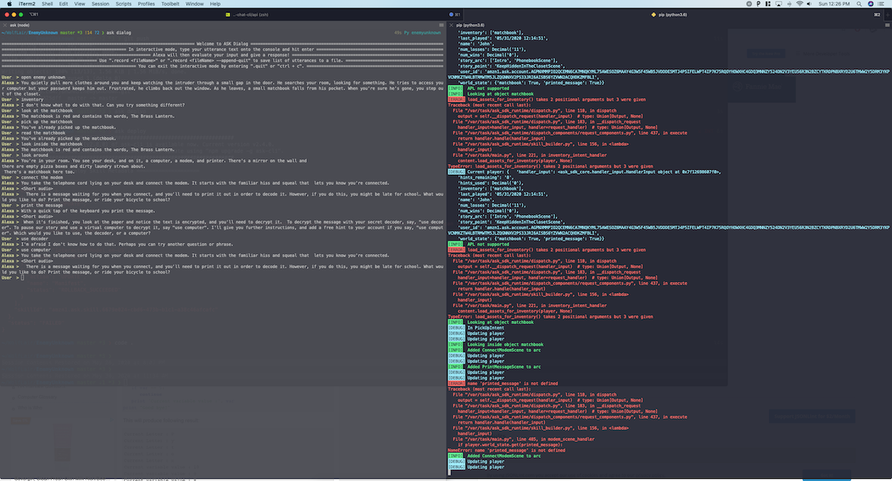

awslogs
=======

``awslogs`` is a simple command line tool for querying groups, streams and events from `Amazon CloudWatch <http://aws.amazon.com/cloudwatch/>` logs.

**This version has been heavily modified from the original, [https://github.com/jorgebastida/awslogs/](https://github.com/jorgebastida/awslogs/)**

### Install and Run

To run this version, install with

```
pip install .
```

Then, open a terminal and run the following to setup continuous monitoring of your logs for that function:

```
awslogs get /aws/lambda/<your-lambda-function-name> ALL --watch --aws-region <your-AWS-region> --no-stream --no-group
```

You can also specify `--profile` for specific AWS profiles. See **Original README** below for a complete list of options.

### Logging statements

The awslogs package shows any "log", "error", or "debug" lines set in your code. For example:

* NodeJS:
    * `console.log("...")`
    * `console.error("...")`
    * `console.debug("...")`

* Python:
    * `logger.log("...")`
    * `logger.error("...")`
    * `logger.debug("...")`

### Demo

Below is a screenshot of awslogs running along side Alexa's `ask dialog` command. Logs on the right were generated in code through `logger.log(...)`, etc., statements.



## Original README

Features
--------

* Aggregate logs from across streams.

  - Aggregate all streams in a group.
  - Aggregate streams matching a regular expression.

* Colored output.
* List existing groups

  - ``$ awslogs groups``

* List existing streams

  - ``$ awslogs streams /var/log/syslog``

* Watch logs as they are created

  - ``$ awslogs get /var/log/syslog ALL --watch``

* Human-friendly time filtering:

  - ``--start='23/1/2015 14:23'``
  - ``--start='2h ago'``
  - ``--start='2d ago'``
  - ``--start='2w ago'``
  - ``--start='2d ago' --end='1h ago'``

* Retrieve event metadata:

  - ``--timestamp`` Prints the creation timestamp of each event.
  - ``--ingestion-time`` Prints the ingestion time of each event.


Example
-------

Running: ``awslogs get /var/logs/syslog ALL -s1d`` will return you events from any ``stream`` in the ``/var/logs/syslog`` group generated in the last day.

.. image:: https://github.com/jorgebastida/awslogs/raw/master/media/screenshot.png


Installation
------------

You can easily install ``awslogs`` using ``pip``::

  $ pip install awslogs

If you are on OSX El Capitan, use the following (Why? Check Donald Stufft's comment `here <https://github.com/pypa/pip/issues/3165#issuecomment-145856429>`_) ::

  $ pip install awslogs --ignore-installed six


Options
-------

* ``awslogs groups``: List existing groups
* ``awslogs streams GROUP``: List existing streams withing ``GROUP``
* ``awslogs get GROUP [STREAM_EXPRESSION]``: Get logs matching ``STREAM_EXPRESSION`` in ``GROUP``.

  - Expressions can be regular expressions or the wildcard ``ALL`` if you want any and don't want to type ``.*``.

**Note:** You need to provide to all these options a valid AWS region using ``--aws-region`` or ``AWS_REGION`` env variable.


Time options
-------------

While querying for logs you can filter events by ``--start`` ``-s`` and ``--end`` ``-e`` date.

* By minute:

  - ``--start='2m'`` Events generated two minutes ago.
  - ``--start='1 minute'`` Events generated one minute ago.
  - ``--start='5 minutes'`` Events generated five minutes ago.

* By hours:

  - ``--start='2h'`` Events generated two hours ago.
  - ``--start='1 hour'`` Events generated one hour ago.
  - ``--start='5 hours'`` Events generated five hours ago.

* By days:

  - ``--start='2d'`` Events generated two days ago.
  - ``--start='1 day'`` Events generated one day ago.
  - ``--start='5 days'`` Events generated five days ago.

* By weeks:

  - ``--start='2w'`` Events generated two week ago.
  - ``--start='1 week'`` Events generated one weeks ago.
  - ``--start='5 weeks'`` Events generated five week ago.

* Using specific dates:

  - ``--start='23/1/2015 12:00'`` Events generated after midday  on the 23th of January 2015.
  - ``--start='1/1/2015'`` Events generated after midnight on the 1st of January 2015.
  - ``--start='Sat Oct 11 17:13:46 UTC 2003'`` You can use detailed dates too.

  Note, for time parsing awslogs uses `dateutil <https://dateutil.readthedocs.io/en/latest/>`_.

* All previous examples are applicable for  ``--end`` ``-e`` too.

Filter options
----------------

You can use ``--filter-pattern`` if you want to only retrieve logs which match one CloudWatch Logs Filter pattern.
This is helpful if you know precisely what you are looking for, and don't want to download the entire stream.

For example, if you only want to download only the report events from a Lambda stream you can run::

  $ awslogs get my_lambda_group --filter-pattern="[r=REPORT,...]"


Full documentation of how to write patterns: http://docs.aws.amazon.com/AmazonCloudWatch/latest/DeveloperGuide/FilterAndPatternSyntax.html

JSON logs
------------

In a similar way than the `aws-cli <http://docs.aws.amazon.com/cli/latest/userguide/controlling-output.html#controlling-output-filter>`_ command, you can use  ``--query`` to
filter each of your json log lines and extract certain fields::

  $ awslogs get my_lambda_group --query=message

This will only display the ``message`` field for each of the json log lines.


Contribute
-----------

* Fork the repository on GitHub.
* Write a test which shows that the bug was fixed or that the feature works as expected.

  - Use ``tox`` command to run all the tests in all locally available python version.

* Send a pull request and bug the maintainer until it gets merged and published. :).

For more instructions see `TESTING.rst`.


Helpful Links
-------------

* http://aws.amazon.com/cloudwatch/
* https://boto.readthedocs.io/en/latest/ref/logs.html
* http://docs.aws.amazon.com/AmazonCloudWatch/latest/DeveloperGuide/cloudwatch_limits.html

How to provide AWS credentials to awslogs
------------------------------------------

Although, the most straightforward thing to do might be use ``--aws-access-key-id`` and ``--aws-secret-access-key``, this will eventually become a pain in the ass.

* If you only have one ``AWS`` account, my personal recommendation would be to configure `aws-cli <http://aws.amazon.com/cli/>`_. ``awslogs`` will use those credentials if available. If you have multiple ``AWS`` profiles managed by ``aws-cli``, just add ``--profile [PROFILE_NAME]`` at the end of every ``awslogs`` command to use those credentials, or set the ``AWS_PROFILE`` env variable.
* If you don't want to setup ``aws-cli``, I would recommend you to use `envdir <https://pypi.python.org/pypi/envdir>`_ in order to make ``AWS_ACCESS_KEY_ID`` and ``AWS_SECRET_ACCESS_KEY`` available to ``awslogs``.
